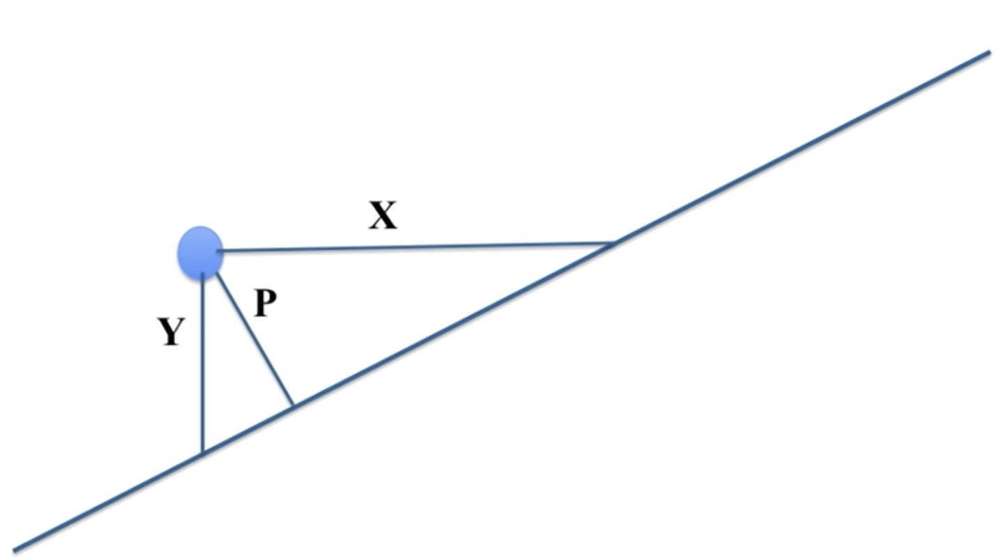
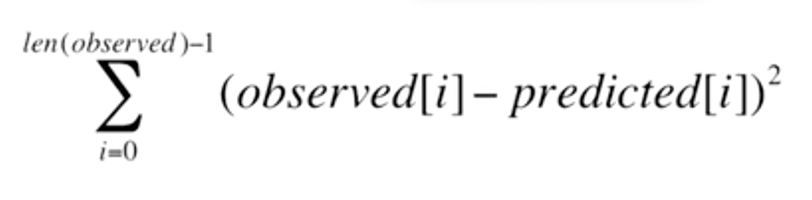
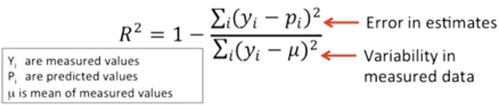

```python
from IPython.display import HTML

HTML('''<script>
code_show=true; 
function code_toggle() {
 if (code_show){
 $('div.input').hide();
 $('#toggleButton').val('Show Code')
 } else {
 $('div.input').show();
 $('#toggleButton').val('Show Code')
 }
 code_show = !code_show
} 
$( document ).ready(code_toggle);
</script>
<form action="javascript:code_toggle()"><input type="submit" id = "toggleButton" value="Hide Code"></form>''')
```


<script>
code_show=true; 
function code_toggle() {
 if (code_show){
 $('div.input').hide();
 $('#toggleButton').val('Show Code')
 } else {
 $('div.input').show();
 $('#toggleButton').val('Show Code')
 }
 code_show = !code_show
} 
$( document ).ready(code_toggle);
</script>
<form action="javascript:code_toggle()"><input type="submit" id = "toggleButton" value="Hide Code"></form>


```python
import pandas as pd
import random
import numpy
from IPython.display import HTML
from matplotlib import pylab
from matplotlib import pyplot as plt
from IPython.display import Image

%run LectureCode.py

```


```python
HTML('<h1><center> Understanding Experimental Data</center></h1>')
```


<h1><center> Understanding Experimental Data</center></h1>


- How do we interpret resuts of experiments 
- How do we analyze results to test current hypotheses 
- How do we use them to inform future experiments/decisions?


```python
HTML('''
<h3>How good are obtained results of experiments?</h3>  <br>
Eg. Hooke's law <br>
Force <b>F</b> = spring constant <b>K</b> * Displacement <b>d</b>
<li> We can get K by measuring F and d for a few observations.
<li> There might be some noise in the data, observed relationship might not be strictly linear.
<li> So generalize over obtained K's, we need to <b>fit a curve</b> to observations.
''')
```


<h3>How good are obtained results of experiments?</h3>  <br>
Eg. Hooke's law <br>
Force <b>F</b> = spring constant <b>K</b> * Displacement <b>d</b>
<li> We can get K by measuring F and d for a few observations.
<li> There might be some noise in the data, observed relationship might not be strictly linear.
<li> So generalize over obtained K's, we need to <b>fit a curve</b> to observations.


```python
HTML('''
<h3> How to define if a fit to the curve is good? </h3> <br>
<li> Using an objective function: Measure of how close curve is to the data.
<li> Best curve is the curve that minimizes objective function, such as : <b>distance of all points from the curve</b>.
''')
```


<h3> How to define if a fit to the curve is good? </h3> <br>
<li> Using an objective function: Measure of how close curve is to the data.
<li> Best curve is the curve that minimizes objective function, such as : <b>distance of all points from the curve</b>.


```python
HTML('''<h3> How to measure distance? </h3>




<p>Options: </p>

<ol>
<li> X axis: Along X we have independant values, distance along X doesn't make sense.</li>
<li> perpendicular: Makes sense in the case of classifiers/separators.</li>
<li> along Y axis: Since along Y we have dependant value, displacement/uncertainty is along Y.</li>
</ol>
''')
```


<h3> How to measure distance? </h3>


<p>Options: </p>

<ol>
<li> X axis: Along X we have independant values, distance along X doesn't make sense.</li>
<li> perpendicular: Makes sense in the case of classifiers/separators.</li>
<li> along Y axis: Since along Y we have dependant value, displacement/uncertainty is along Y.</li>
</ol>


```python
HTML('''<h3> How to set objective function? </h3>

<br>
Equivalent to Variance * No. of observations<br>
Equivalent to Variance between actual and predicted, makes sensse to minimize<br>
''')
```


<h3> How to set objective function? </h3>

<br>
Equivalent to Variance * No. of observations<br>
Equivalent to Variance between actual and predicted, makes sensse to minimize<br>


```python
HTML('''
<h3> How to minimize objective function?</h3><br>

<li> Assumption in the example: best fit is a line degree 1 polynomial, so using linear regression.
<li> With best fit line: ax + b
    <ul>
        <li>All possible values of x give a line, 
        <li>All possible values of a and b give a surface.
     </ul>   
<li> Linear Regression: start at a point on this surface, walk downhill: 
linearly regress until you get to the lowest point. 
<li> Sum of squared makes sure hill surface only has 1 minimum.
''')
```


<h3> How to minimize objective function?</h3><br>

<li> Assumption in the example: best fit is a line degree 1 polynomial, so using linear regression.
<li> With best fit line: ax + b
    <ul>
        <li>All possible values of x give a line, 
        <li>All possible values of a and b give a surface.
     </ul>   
<li> Linear Regression: start at a point on this surface, walk downhill: 
linearly regress until you get to the lowest point. 
<li> Sum of squared makes sure hill surface only has 1 minimum.


```python
HTML('''
<h3>How good is the fit?</h3>
<p> For data below Quadratic appears to be a better fit. <br>
Could higher order polynomials be a better fit? <br> 
What is the best way to do the fit?
''')

#Demonstration using mystery data

xVals, yVals = getData('mysteryData.txt')
pylab.plot(xVals, yVals, 'o', label = 'Data Points')
pylab.title('Mystery Data')

#Try linear model
model1 = pylab.polyfit(xVals, yVals, 1)
pylab.plot(xVals, pylab.polyval(model1, xVals),
          label = 'Linear Model')

#Try a quadratic model
model2 = pylab.polyfit(xVals, yVals, 2)
pylab.plot(xVals, pylab.polyval(model2, xVals),
          'r--', label = 'Quadratic Model')
pylab.legend()
plt.show()
```


```python

##Compare models
def aveMeanSquareError(data, predicted):
    error = 0.0
    for i in range(len(data)):
        error += (data[i] - predicted[i])**2
    return error/len(data)

# Avg MSE for linear model:
estYVals_l = pylab.polyval(model1, xVals)

# Avg MSE for quadratic model:
estYVals_q = pylab.polyval(model2, xVals)

HTML('''Average MSE for:<br>
<li> Linear Model: '''+str(aveMeanSquareError(yVals, estYVals_l).round(2))+'''
<li> Quadratic Model: '''+str(aveMeanSquareError(yVals, estYVals_q).round(2))+'''
<li>Quadratic has lower MSE, but is 1524.02 good enough? 
<li> Also MSE is scale dependant, it will go up for another set of values if values themselves are high.
<li> We would need a metric that is scale independant.

''')
```


Average MSE for:<br>
<li> Linear Model: 9372.73
<li> Quadratic Model: 1524.02
<li>Quadratic has lower MSE, but is 1524.02 good enough? 
<li> Also MSE is scale dependant, it will go up for another set of values if values themselves are high.
<li> We would need a metric that is scale independant.


```python
HTML('''
<h3>Co-efficient of determination:</h3>
<li> COD accounts for inherent variability in the data:
<br>

<br>
<li> This is a ratio, so it is scale independant.
<br>
''')
```


<h3>Co-efficient of determination:</h3>
<li> COD accounts for inherent variability in the data:
<br>

<br>
<li> This is a ratio, so it is scale independant.
<br>


```python
def rSquared(observed, predicted):
    error = ((predicted - observed)**2).sum()
    meanError = error/len(observed)
    return 1 - (meanError/numpy.var(observed))

# Mean Error/Variance is same as error in estimates/variability

# Generate fits of different degrees
def genFits(xVals, yVals, degrees):
    models = []
    for d in degrees:
        model = pylab.polyfit(xVals, yVals, d)
        models.append(model)
    return models

# test Fits
def testFits(models, degrees, xVals, yVals, title):
    pylab.plot(xVals, yVals, 'o', label = 'Data')
    for i in range(len(models)):
        estYVals = pylab.polyval(models[i], xVals)
        error = rSquared(yVals, estYVals)
        pylab.plot(xVals, estYVals,
                   label = 'Fit of degree '\
                   + str(degrees[i])\
                   + ', R2 = ' + str(round(error, 5)))
    pylab.legend(loc = 'best')
    pylab.title(title)

    
#code for testing goodness of fit to parabolic data

xVals, yVals = getData('mysteryData.txt')
degrees = (1, 2)
models = genFits(xVals, yVals, degrees)
testFits(models, degrees, xVals, yVals, 'Mystery Data')
```


```python
HTML('''
<h3> Interpretaton of Co-Effecient of Determination:</h3>
<br> 
<b>What Percentage of variability in data is explained in the model: </b>

<li>Linear fit is accounting for < 1% of the variability in the data.</li>
<li>Quadratic fit is accounting for 83% of the variability in the data.</li>
''')

```


<h3> Interpretaton of Co-Effecient of Determination:</h3>
<br> 
<b>What Percentage of variability in data is explained in the model: </b>

<li>Linear fit is accounting for < 1% of the variability in the data.</li>
<li>Quadratic fit is accounting for 83% of the variability in the data.</li>


```python

```


```python
HTML('''
<h3> Compare higher order fits:</h3>

''')

#Compare higher-order fits
degrees = (2, 4, 8, 16)
models = genFits(xVals, yVals, degrees)
testFits(models, degrees, xVals, yVals, 'Mystery Data')
```


```python
HTML(
'''
<li> Just because Polynomial of degree 16 fits the data best, does not mean we should use it. Continued in next lecture </li>
<hr>
<div dir = "rtl">
<ul style = 'list-style-type:square'>
<li> End of Document
</li>

'''

)
```


<li> Just because Polynomial of degree 16 fits the data best, does not mean we should use it. Continued in next lecture </li>
<hr>
<div dir = "rtl">
<ul style = 'list-style-type:square'>
<li> End of Document
</li>


```python
HTML('''<script>
$(document).ready(function(){
    $('div.prompt').hide();
    $('div.input').hide()
    $('div.back-to-top').hide();
    $('nav#menubar').hide();
    $('.breadcrumb').hide();
    $('.hidden-print').hide();
 });
</script>
''')
```


<script>
$(document).ready(function(){
    $('div.prompt').hide();
    $('div.input').hide()
    $('div.back-to-top').hide();
    $('nav#menubar').hide();
    $('.breadcrumb').hide();
    $('.hidden-print').hide();
 });
</script>


```python

```
